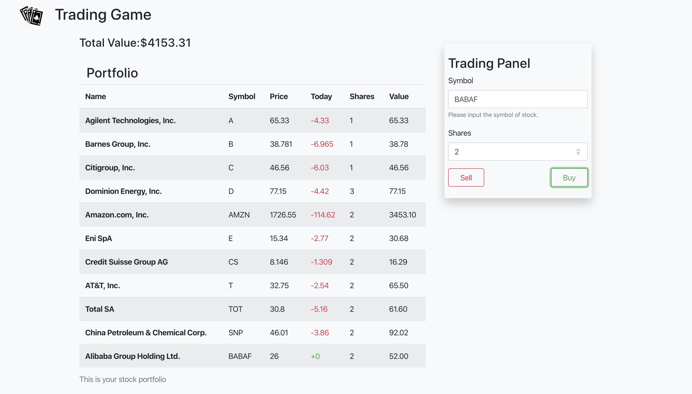
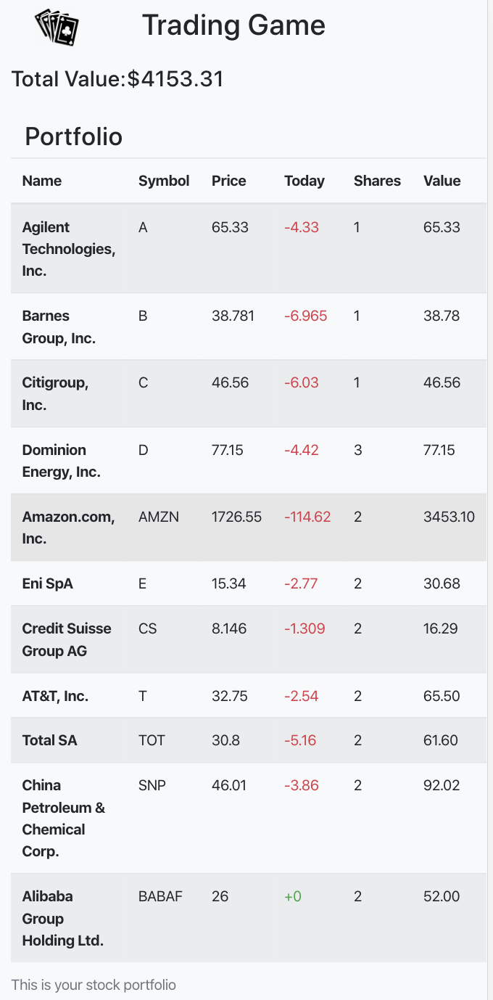

# Trading Game

## Overview

  
  

## Requirments

    Node.js v12.16.1
    React v16.13.1

## To Start the Project
In the project directory, you can run:

    npm start

Runs the app in the development mode. 
Open [http://localhost:3000](http://localhost:3000) to view it in the browser.

## Buy Stock

Type symbol and shares of stock into Trading Panel, then click "Buy" button

## Sell Stock

Type symbol and shares of stock into Trading Panel, then click "Sell" button

## Sort Portfolio

You can sort the portfolio by clicking the head of the table (Name, Symbol, Price, etc.)

